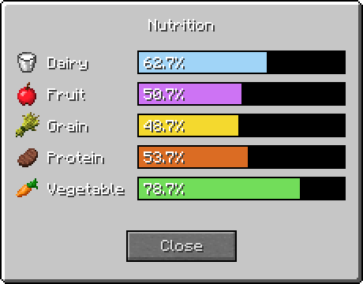

# Nutrition

Nutrition is a highly configurable mod to enable the creation of health systems in Minecraft.

[Download](https://github.com/WesCook/Nutrition/releases) | [Wiki](https://github.com/WesCook/Nutrition/wiki) | [Changelog](changelog.md)

Through its [config files](https://github.com/WesCook/Nutrition/wiki/Configuration), Nutrition allows you to define custom food groups (called [nutrients](https://github.com/WesCook/Nutrition/wiki/Nutrients)) which apply [effects](https://github.com/WesCook/Nutrition/wiki/Effects) based on nutrition levels.

By default, Nutrition comes configured with the classic five food group system: dairy, fruit, grain, protein, and vegetables.  However many different systems are possible.  Some examples include:

* A spicy tolerance bar, where eating enough spicy foods will grant a permanent resistance to fire.
* A zombie simulation where you must eat brains to avoid negative effects.
* Gluten intolerance.  Eat bread, get sick.

When updating the mod, please delete your `/config/nutrition/nutrients/` directory to receive new mod support.  This is necessary so we don't overwrite any customizations.

## Mods Supported

Mods that are supported with the default five-food group system include:

* [AbyssalCraft](https://www.curseforge.com/minecraft/mc-mods/abyssalcraft)
* [Actually Additions](https://www.curseforge.com/minecraft/mc-mods/actually-additions)
* [Advent of Ascension](https://www.curseforge.com/minecraft/mc-mods/advent-of-ascension-nevermine)
* [The Aether](https://www.curseforge.com/minecraft/mc-mods/the-aether)
* [akkamaddi's Ashenwheat](https://www.curseforge.com/minecraft/mc-mods/akkamaddis-ashenwheat)
* [Animalium](https://www.curseforge.com/minecraft/mc-mods/animalium)
* [Animania](https://www.curseforge.com/minecraft/mc-mods/animania)
* [Aquaculture](https://www.curseforge.com/minecraft/mc-mods/aquaculture)
* [Beasts](https://www.curseforge.com/minecraft/mc-mods/beasts)
* [Better Animals Plus](https://www.curseforge.com/minecraft/mc-mods/betteranimalsplus)
* [BetterNether](https://www.curseforge.com/minecraft/mc-mods/betternether)
* [Better with Addons](https://www.curseforge.com/minecraft/mc-mods/better-with-addons)
* [Better with Mods](https://www.curseforge.com/minecraft/mc-mods/bwm-suite)
* [The Betweenlands](https://www.curseforge.com/minecraft/mc-mods/angry-pixel-the-betweenlands-mod)
* [Bewitchment](https://www.curseforge.com/minecraft/mc-mods/bewitchment)
* [Biomes O' Plenty](https://www.curseforge.com/minecraft/mc-mods/biomes-o-plenty)
* [The Birdwatching Mod](https://www.curseforge.com/minecraft/mc-mods/the-birdwatching-mod)
* [Cave Root](https://www.curseforge.com/minecraft/mc-mods/cave-root)
* [ChinjufuMod](https://www.curseforge.com/minecraft/mc-mods/chinjufumod)
* [Chococraft](https://www.curseforge.com/minecraft/mc-mods/chococraft-3)
* [Combustive Fishing](https://www.curseforge.com/minecraft/mc-mods/combustive-fishing)
* [Complex Crops](https://www.curseforge.com/minecraft/mc-mods/complex-crops)
* [Defiled Lands](https://www.curseforge.com/minecraft/mc-mods/defiled-lands)
* [Duck Craft](https://www.curseforge.com/minecraft/mc-mods/duck-craft)
* [Edible Bugs](https://www.curseforge.com/minecraft/mc-mods/edible-bugs)
* [Erebus](https://www.curseforge.com/minecraft/mc-mods/the-erebus)
* [Exotic Birds](https://www.curseforge.com/minecraft/mc-mods/exotic-birds)
* [Ex Sartagine](https://www.curseforge.com/minecraft/mc-mods/ex-sartagine)
* [Extra Utilities 2](https://www.curseforge.com/minecraft/mc-mods/extra-utilities)
* [Familiar Fauna](https://www.curseforge.com/minecraft/mc-mods/familiar-fauna)
* [Fauna and Ecology](https://www.curseforge.com/minecraft/mc-mods/fauna-and-ecology)
* [Food Expansion](https://www.curseforge.com/minecraft/mc-mods/food-expansion)
* [Forestry](https://www.curseforge.com/minecraft/mc-mods/forestry)
* [Fossils and Archeology Revival](https://www.curseforge.com/minecraft/mc-mods/fossils)
* [Galacticraft](https://micdoodle8.com/mods/galacticraft)
* [Glacidus](https://www.curseforge.com/minecraft/mc-mods/glacidus)
* [Grim Pack](https://www.curseforge.com/minecraft/mc-mods/grim-pack)
* [Grimoire of Gaia](https://www.curseforge.com/minecraft/mc-mods/grimoire-of-gaia)
* [Growthcraft Community Edition](https://www.curseforge.com/minecraft/mc-mods/growthcraft-community-edition)
* [Heat and Climate](https://defeatedcrow.jp/modwiki/HeatAndClimate_EN)
* [Ice and Fire](https://www.curseforge.com/minecraft/mc-mods/ice-and-fire-dragons)
* [Inspirations](https://www.curseforge.com/minecraft/mc-mods/inspirations)
* [JAFFA Foods](https://www.curseforge.com/minecraft/mc-mods/jaffa-foods-a-harvestcraft-addon)
* [JurassiCraft](https://www.curseforge.com/minecraft/mc-mods/jurassicraft)
* [Lycanites Mobs](https://www.curseforge.com/minecraft/mc-mods/lycanites-mobs)
* [The Midnight](https://www.curseforge.com/minecraft/mc-mods/the-midnight)
* [Mo' Creatures](https://www.curseforge.com/minecraft/mc-mods/mo-creatures)
* [Mob Mash](https://www.curseforge.com/minecraft/mc-mods/mob-mash)
* [Mystical World](https://www.curseforge.com/minecraft/mc-mods/mystical-world)
* [Natura](https://www.curseforge.com/minecraft/mc-mods/natura)
* [Natural Fauna](https://www.curseforge.com/minecraft/mc-mods/natural-fauna-mod-a-zawa-addon)
* [NetherEx](https://www.curseforge.com/minecraft/mc-mods/netherex)
* [Oh The Biomes You'll Go](https://www.curseforge.com/minecraft/mc-mods/oh-the-biomes-youll-go)
* [Pam's BreadCraft](https://www.curseforge.com/minecraft/mc-mods/pams-breadcraft)
* [Pam's BrewCraft](https://www.curseforge.com/minecraft/mc-mods/pams-brewcraft)
* [Pam's HarvestCraft](https://www.curseforge.com/minecraft/mc-mods/pams-harvestcraft)
* [Pam's Simply Strawberries](https://www.curseforge.com/minecraft/mc-mods/pams-simply-strawberries)
* [PizzaCraft](https://www.curseforge.com/minecraft/mc-mods/pizzacraft)
* [Plant Mega Pack](https://web.archive.org/web/20181020031322/http://10paksmods.net/pmp.html)
* [Plants](https://www.curseforge.com/minecraft/mc-mods/plants)
* [PrimalCore](https://www.curseforge.com/minecraft/mc-mods/primalcore)
* [Primitive Mobs](https://www.curseforge.com/minecraft/mc-mods/primitive-mobs)
* [Project: Vibrant Journeys](https://www.curseforge.com/minecraft/mc-mods/project-vibrant-journeys)
* [Pyrotech](https://www.curseforge.com/minecraft/mc-mods/pyrotech)
* [Quark](https://quark.vazkii.net/)
* [Rats](https://www.curseforge.com/minecraft/mc-mods/rats)
* [RealWorld](https://web.archive.org/web/20181008045611/https://10paksmods.net/realworld.html)
* [Reptile Mod](https://www.curseforge.com/minecraft/mc-mods/lizardmod/files/3247823)
* [Rockhounding Surface](https://www.curseforge.com/minecraft/mc-mods/rockhounding-mod-surface)
* [Roots](https://www.curseforge.com/minecraft/mc-mods/roots)
* [Roots Classic](https://www.curseforge.com/minecraft/mc-mods/roots-classic)
* [Rustic](https://www.curseforge.com/minecraft/mc-mods/rustic)
* [SaltyMod](https://www.curseforge.com/minecraft/mc-mods/saltymod)
* [Simple Corn](https://www.curseforge.com/minecraft/mc-mods/simple-corn)
* [Simply Tea!](https://www.curseforge.com/minecraft/mc-mods/simply-tea)
* [Skye's Bakery](https://www.curseforge.com/minecraft/mc-mods/skyes-bakery)
* [Taco Tuesday](https://www.curseforge.com/minecraft/mc-mods/taco-tuesday)
* [Tea the Story](https://www.curseforge.com/minecraft/mc-mods/tea-the-story)
* [Thaumcraft](https://www.curseforge.com/minecraft/mc-mods/thaumcraft)
* [Tinkers Construct](https://www.curseforge.com/minecraft/mc-mods/tinkers-construct)
* [Tiny Progressions](https://www.curseforge.com/minecraft/mc-mods/tiny-progressions)
* [Tropicraft](https://www.curseforge.com/minecraft/mc-mods/tropicraft)
* [Twilight Forest](https://www.curseforge.com/minecraft/mc-mods/the-twilight-forest)
* [VanillaFoodPantry](https://www.curseforge.com/minecraft/mc-mods/vanillafoodpantry-mod)
* [XL Food Mod](https://www.curseforge.com/minecraft/mc-mods/xl-food-mod)
* [Zoo & Wild Animals Rebuilt](https://www.curseforge.com/minecraft/mc-mods/zoo-wild-animals-rebuild)

Mod support contributions are welcome!  Please create a [Pull Request](https://github.com/WesCook/Nutrition/pulls) or an [Issue](https://github.com/WesCook/Nutrition/issues) with the relevant .json files.
